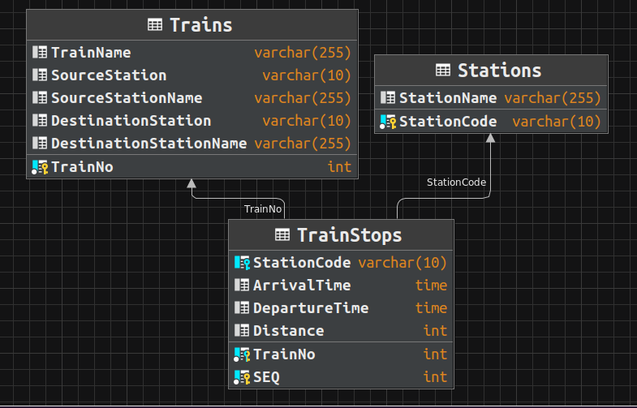

# Swym Build Challenge
Hello I am Pratham Bhat from PES University and this is my submission for the Swym Build Challenge.
I have picked the Railway Timetable Assignment.

## Problem Statement
Our CSV puts midnight (00:00:00) as arrival time at all origin stations and also departure
time from destination stations. How will you handle this ?
a. Can you find the list of all trains that arrive at a station at midnight ?
2. What are the maximum, minimum and average halts for trains ? Is it enough to just
subtract the departure time from arrival time to get the halt time ? What about trains that
arrive just before midnight and leave some time after midnight ?
3. Given a pair of start and end stations for my journey, how many trains can I take for
example from Jalandhar to Amritsar ? The start and end stations may not correspond to
the start and end stations on a train route.
a. For simplicity do not consider break journeys where you change trains.

## Technologies used
- Python 3.10
- Streamlit
- Mysql
- Pandas

## How to run
- Clone the repo
- Create a virtual environment
- Install the requirements
```shell
pip install -r requirements.txt
```
- Install mysql and create a database
- Run the sql script in the database after modifying the paths
- Modify the code to add your database credentials
- Run the following commands
```shell
streamlit run app.py
```
- Open the link in your browser

## Database Schema


## Demo Screenshots


